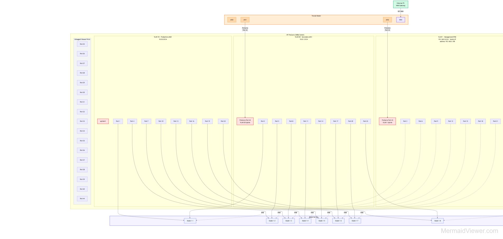
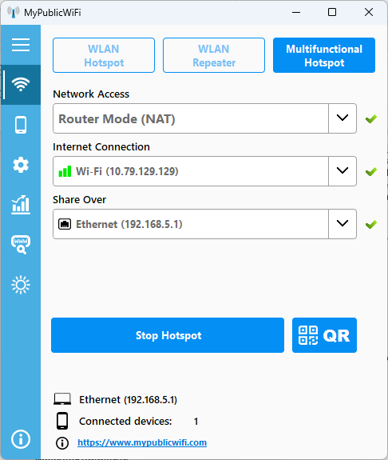
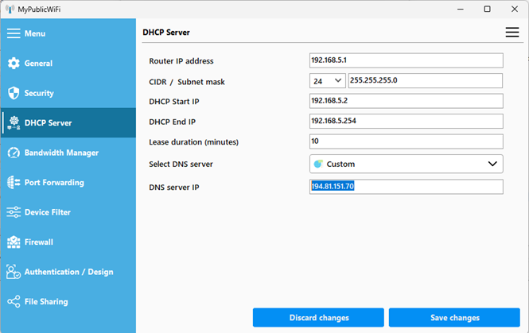

[Main Menu](../../../sessions/README.md) |[sessionX](../../sessionX/) | [Session X Notes](../docs/sessionNotes.md)

# Session X Notes

# supermicro

BIOS : Delete (Del) key repeatedly during the Power-On Self-Test (POST). Some models may require pressing F11 or F12 to open the boot menu OR ctrl -s 

# network diagram

The diagram now shows the complete ProCurve switch configuration with all 44 ports accounted for

# pc / mypublicwifi

pc is sharing eduroam internet connection to provide a gateway to the network
using mypublicwifi https://mypublicwifi.com/publicwifi/en/index.html

|---------------------------------------|----------------------------------------|
 | |

mypublic wifi DHCP settings (provides ip address to trenda router)
* PC router  192.168.5.1 (mypublicwifi)
* trenda WAN 192.168.5.2 (via dhcp on mypublicwifi)
* set up dns to use eduroam dns - currently 194.81.151.70

# simple router trenda - discontinued

Set up to allow login from wan

http://192.168.5.2/login.html  (admin/admin)

|Router |Connectivity |
|:------|:------------|
| eth0  |  Free |
| eth1  |  ProCurve Port 42 (VLAN 20 Uplink) |
| eth2  |  ProCurve Port 43 (VLAN 1 Uplink) used for IPMI and internet gateway|
| WAN  | connected to PC/mypublicwifi gateway  |

# Netgear prosafe FV318

Set up to allow login from wan

static wan setting
* ip 192.168.5.2
* gw 192.168.5.1
* dns 194.81.151.70 (dns from solent eduroam)

Login router
* http://192.168.105.1/basicsetting.htm  (admin/password)
* http://192.168.5.2/basicsetting.htm
* http://www.routerlogin.net/basicsetting.htm  

note that routerlogin.net needs to be set on pc using hosts file to 192.168.5.2
* \Windows\System32\drivers\etc\hosts
* add line 192.168.5.2     www.routerlogin.net

|Router port |Connectivity |
|:-----------|:------------|
| 1  |  ProCurve Port 42 (VLAN 20 Uplink) |
| 2  |  ProCurve Port 43 (VLAN 1 Uplink) used for IPMI and internet gateway|
| 3-8 | free |
| WAN  | connected to PC/mypublicwifi gateway  |

# layer 2 switch   ProCurve

|procurve vlan         |ports |
|:---------------------|:------------|
|VLAN 10 (Production)  |  Ports 1, 4, 7, 10, 13, 16, 19, 22 + Port 41 (Router uplink) |
|VLAN 20 (Secondary)   |  Ports 2, 5, 8, 11, 14, 17, 20 + Port 42 (Router uplink) |
|VLAN 1 (Management/IPMI)|  Ports 3, 6, 9, 12, 15, 18, 21, 23, 24 + Port 43 (Router uplink) |
|Untagged/Unused|  Ports 25-40, 44 (17 ports available for future use) |

| server name       | Management IP  | Management MAC | Mangement switch port | notes             |
|:------------------|:------------------|:------------------|:-------------------------|:------------------|
| procurve switch   |192.168.105.100    |                   | 43 VLAN 1 (default)      | not using dhcp/bootp but static address as doesn't seem to work | 

| server name       | ipmi IP        | ipmi MAC       | ipmi switch port |eth0 enp1s0f1 IP| eth0 MAC       | eth0 switch port  |eth1 enp1s0f1 IP| eth1 MAC       | eth1 switch port  | notes           |
|:------------------|:------------------|:------------------|:--------------------|:------------------|:------------------|:------------------|:------------------|:------------------|:------------------|:----------------|
| blade-1-1         | 192.168.105.101   |00:25:90:58:03:4F  | 3                   |                   |                   | 1                 |                   |                   | 2                 |                 |
| blade-1-2         | 192.168.105.102   |00:25:90:54:6D:5F  | 6                   |                   |                   | 4                 |                   |                   | 5                 |                 |
| blade-1-3         | 192.168.105.103   |00:25:90:58:03:33  | 9                   |                   |                   | 7                 |                   |                   | 8                 |                 |
| blade-1-4         | 192.168.105.104   |00:25:90:58:03:43  | 12                  |                   |                   | 10                |                   |                   | 11                |                 |
| blade-1-5         | 192.168.105.105   |00:25:90:54:6D:59  | 15                  |                   |                   | 13                |                   |                   | 14                |                 |
| blade-1-6         | 192.168.105.106   |00:25:90:58:03:8F  | 18                  |                   |                   | 16                |                   |                   | 17                |                 |
| blade-1-7         | 192.168.105.107   |00:25:90:54:6D:32  | 21                  |                   |                   | 19                |                   |                   | 20                |                 |
| blade-1-8         | 192.168.105.108   |00:25:90:58:03:30  | 24                  |                   |00:25:90:3D:0F:BA  | 22                | 192.168.105.118   | 00:25:90:3D:0F:BB | 23                | eth1 port 23 is in VLAN 1                |                 
|                   |                   |                   |                     |                   |                   |                   |                   |                   |                   |                 |
|                   |                   |                   |                     |                   |                   |                   |                   |                   |                   |                 |
|                   |                   |                   |                     |                   |                   |                   |                   |                   |                   |                 |
|                   |                   |                   |                     |                   |                   |                   |                   |                   |                   |                 |
